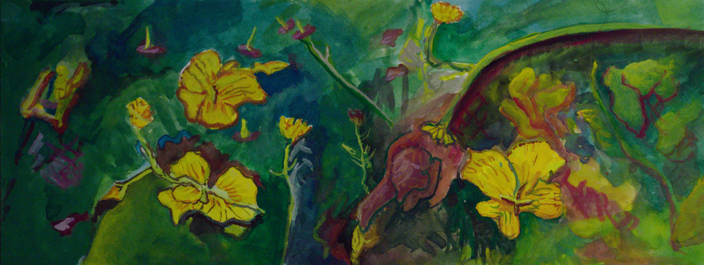
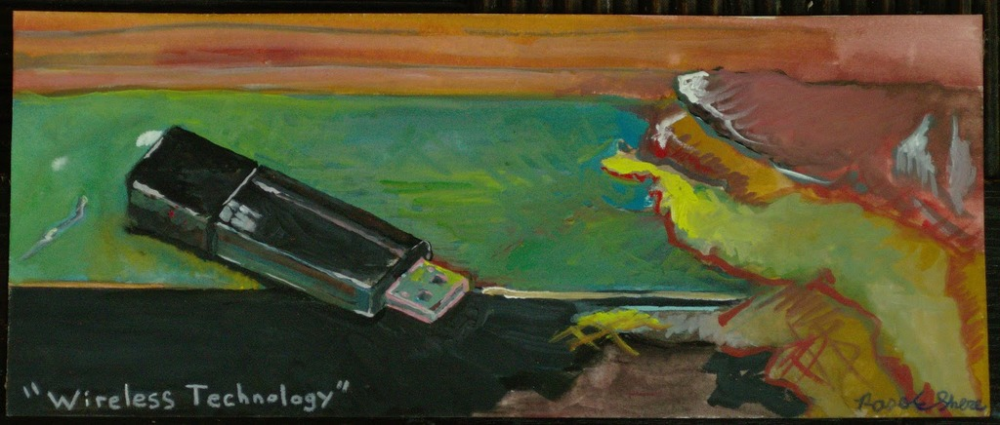
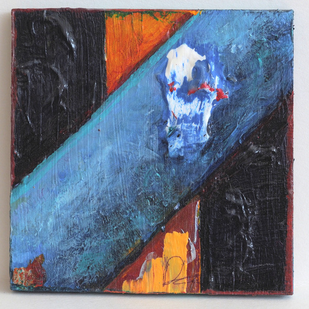
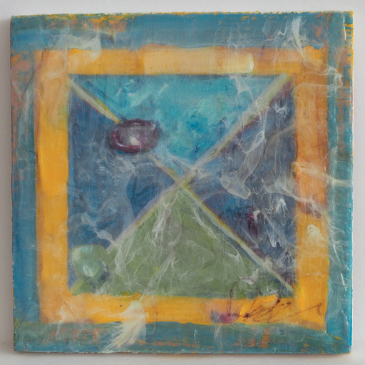
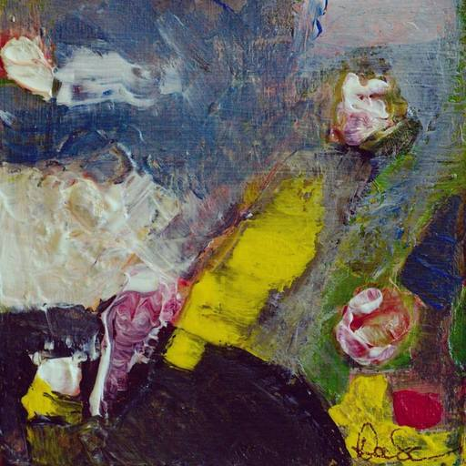
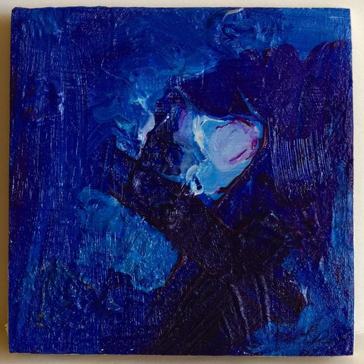
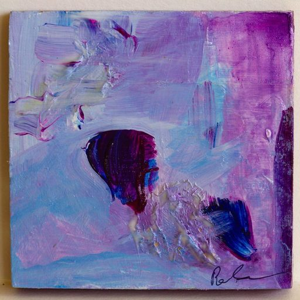

# David | Rose E. Shere

Born and raised in Sonoma County just outside the Technology center that is the Bay Area, Shere walks the line between Traditional and Contemporary praticies.  An early introduction to Digital Art through a specialized High School program that emphasized a physical sketchbook as the most important aspect of the practice left a lasting impression, leading to acceptance into UC Santa Cruz's Fine Art Major where Painting and Drawing were a major focus.  Informed and inspired by Richard Stallman and the Free Software Foundation an open stance is taken toward process and collaboration, through which the history of Religious Iconography enters in; a connection is drawn between the Logic of Computer Science and the Logic of the Holy Bible where the process is approached as Writing rather than Painting or Drawing.  After an educational gap that lead to an immersion in Western Theravada Buddhism and a deep practice of meditation and prayer these threads were drawn together through participation in UC San Diego's Interdisciplinary Computing and the Arts Program and acceptance into the Studio Art Honors Program.  Through this a more cohesive approach to the phenomenological aspect of Artwork as Thing and an appreciation for the physical reality of even two-dimensional Art (and implicitly the lack of physical reality of the Digital Image) underscores issues of Proof vs. Faith and questions regarding the economics of our Digital Age.

[See my Curriculum Vitae.](CV.md)

[Visit my repositories on GitHub.](https://github.com/Wollw)

## Address (Please Inquire)
David | Rose E. Shere 
PO Box 2108 
Glen Ellen, CA 95442 
USA 
rshere@wollw.com
